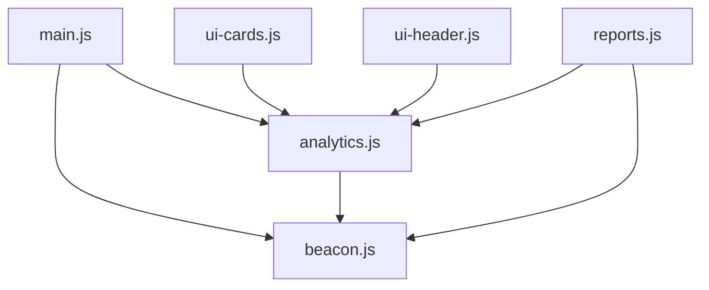

CreatorGrid.app — Static Visitor + Full System Instruction Document

This build now reads all public‑facing branding, layout, and links from
`/config/profile.json` and `/config/links.json`.  Theme tokens, header and
footer links, and marketing copy are injected at runtime so the visitor page
matches the creator's configuration without manual edits.
Part 1 — Cards & Reporting
________________________________________
1. Card Design
Structure
•	Each card is a self-contained interactive unit.
•	Entire card is a single clickable anchor linking to the external target_url.
•	The title is not a separate link — the whole card is the link surface, except for the “i” button.
•	HTML outline:
•	<a class="card" data-uid="uid-123" data-source="ig" href="https://…" target="_blank" rel="noopener">
•	  
•	  <button class="icon-btn dot-btn" type="button" aria-label="Report or more actions">⋯</button>
•	  <div class="card-footer">
•	    <h3 class="title two-lines">Clamped Title…</h3>
•	  </div>
•	</a>
Dimensions
•	Aspect ratio fixed at 742×960. (for image only)
•	object-fit: cover for thumbnails.
•	Card radius controlled by --creator-card-radius:
o	Blocky mode = 4px.
o	Rounded mode = 18–24px.
Title block
•	Always two lines tall (constant height).
•	CSS: -webkit-line-clamp:2 with min-height:2.6em.
•	Overflow → … ellipsis.
•	Font-weight adjustable (600 or 700).
•	Color inherits from theme --text.
UID
•	Every card has data-uid attribute.
•	UID is propagated in all report events and analytics payloads.
•	Used for deduplication, moderation, and owner identification.
________________________________________
2. “i” Button (More Actions)
Design
•	Circular button top-right.
•	Persistent halo background (rgba dark fill) ensures readability even on bright images.
•	Size: 28–36px selectable.
•	States:
o	Default: translucent halo.
o	Hover: slight scale-up, rim highlight.
o	Active: pressed shadow.
Behavior
•	Opens dropdown menu (#menu) positioned under the button.
•	Click is isolated: does not bubble to the card link.
•	If the card is already reported (UID locked), button is disabled and does nothing.
________________________________________
3. Dropdown Menu (Report Reasons)
Shared element
•	One global #menu reused for all cards.
•	Absolute-positioned near the trigger.
•	role="menu", aria-hidden toggled.
•	Clamp: two lines max, ellipsis overflow.
Options
•	Exactly 4 warnings (baseline set):
1.	Spam
2.	Misleading
3.	Mature / NSFW
4.	Copyright
Dismiss rules
•	Close when clicking outside, pressing Esc, or opening another card’s menu.
•	Keep within viewport (flip above if needed).
•	Internal scroll if more items added.
________________________________________
4. Modal Form (Report)
Open flow
•	Selecting a menu option opens modal #modal.
•	Type field pre-filled with chosen reason; read-only.
•	UID auto-attached invisibly.
Fields
•	Name (optional).
•	Email (optional).
•	Type (readonly, from menu).
•	Message (required).
Design
•	Backdrop: solid dim black (no glass to avoid distraction).
•	Panel: matte dark surface, radius 16px, border 1px subtle.
•	Buttons:
o	Cancel (neutral gray).
o	Submit (primary brand gradient).
Behavior
•	Esc key or backdrop click closes modal.
•	Focus trap inside modal.
•	Submit triggers thank-you state.
________________________________________
5. Report Deduplication
Logic
•	Track reported card UIDs in reported set.
•	If UID already reported:
o	Dot button disabled, menu does not open.
•	Prevents duplicate reports in same session.
•	Server-side deduplication later will also validate.
________________________________________
6. Success Animation
On submit
•	Modal form replaced by success block:
o	“✅ Thank you — our team will review and take action.”
•	CSS animation: scale-in 0.28s ease-out.
•	Auto-closes modal after ~1.1s.
•	Lock card UID in memory.
________________________________________
7. Card States
Cards have lifecycle states for rendering rules:
•	live — normal interactive card.
•	hidden — not rendered in visitor grid.
•	needs_fix — not rendered.
•	suspended — never rendered.
•	deleted — removed.
Pinned cards are always live; other states override.
________________________________________
8. Pinned Cluster
•	First N=6 cards flagged pinned:true.
•	Rendered first in original order.
•	Stay fixed at top cluster regardless of lazy load.
•	Do not remove pinned cards during virtualization.
•	Filter respects source: pinned IG shows in IG tab; pinned TT shows in TT tab.
________________________________________
9. Subtle Animations
•	Card hover: translateY(-2px), shadow soften.
•	Card active: rim highlight (box-shadow:0 0 0 2px var(--rim) inset).
•	Dot button hover: slight scale-up.
•	Menu open: fade + translateY(4px).
•	Skeleton loaders: shimmer effect keyframes.
•	Success modal: pop-in.
________________________________________
10. Analytics Hooks
Events (console-stubbed, throttled ≤10/10s):
•	card_click → { uid }
•	card_impression → { uid, ts } when 50% visible once.
•	report_open → { uid, reason } when modal opens.
•	report_submit → { uid, reason } when submitted.
________________________________________

Part 2 — Header & Footer
________________________________________
2. Header System
Structure
•	<header class="header"> contains:
o	Left: Logo (padded, clickable).
o	Center: Handle + 3 quick links.
o	Right: Hamburger button toggling overflow menu.
HTML skeleton
<header class="header h1">
  <div class="header-left">
    
    <span id="handle">@creator</span>
  </div>
  <nav class="header-links">
    <a href="#">Link A</a>
    <a href="#">Link B</a>
    <a href="#">Link C</a>
  </nav>
  <button id="hamburger" aria-controls="hamburgerMenu" aria-expanded="false">☰</button>
  <div id="hamburgerMenu" role="menu" aria-hidden="true">
    <!-- 10+ links here -->
  </div>
</header>
________________________________________
Logo
•	Size controlled by --logo-size (56 | 64 | 72 px).
•	Radius 12–16px.
•	Box-shadow subtle.
•	Always padded from screen edge.
Handle
•	Font-size controlled by --handle-size (18 | 20 | 24 px).
•	Weight: 600–800.
•	Color = --text.
•	Updates live when font changed in overlay.
Quick links (center)
•	Exactly 3 visible at all times.
•	Style options: Text | Pill.
•	Hover states: underline or background pill.
•	Click → header_link_click analytics event.
Hamburger
•	Icon button right side.
•	Opens #hamburgerMenu.
•	Menu rules:
o	max-height:60vh on mobile, 80vh on desktop.
o	Internal scroll, never full-screen.
o	Width min(320px,92vw).
•	Contains 10 seed links (X, IG, TikTok, YouTube, Facebook, Google, LinkedIn, GitHub, Notion, Website).
•	Behavior: toggles aria-expanded, closes on outside click or Esc.
________________________________________
Header Variants (≥5 layouts)
1.	H1: Classic Glass
o	Left logo+handle, center 3 links, right hamburger.
o	Glass background, thin border, soft shadow.
2.	H2: Solid Bar
o	Opaque bar.
o	Links styled as pills.
o	Slightly reduced height.
3.	H3: Split Header
o	Left: logo.
o	Center: handle.
o	Right: 3 links inline + hamburger.
o	Balance for wider desktop.
4.	H4: Stacked Compact
o	Row 1: logo + hamburger.
o	Row 2: centered 3 links.
o	Mobile-focused.
5.	H5: Emphasized Brand
o	Larger logo.
o	Handle bold (font-weight:800).
o	Gradient underline for links.
________________________________________
Header Tokens
•	--header-bg (rgba, solid or gradient).
•	--header-blur (0–30px).
•	--header-bd (border color).
•	--header-radius.
•	--header-gap.
•	--handle-size.
•	--logo-size.
Overlay Controls
•	Header layout (H1–H5).
•	Handle font size (S/M/L).
•	Logo size (56/64/72).
•	Link style (Text | Pill).
•	Background: solid or gradient.
•	Blur/opacity.
________________________________________
3. Footer System
Structure
•	<footer class="footer f1"> contains:
o	Primary link row (up to 5 icons).
o	Constant row: Privacy Policy, Create Account.
o	Disclaimer line (italic, muted).
HTML skeleton
<footer class="footer f1">
  <div class="footer-links">
    <a href="#" aria-label="WhatsApp"></a>
    <a href="#" aria-label="Instagram"></a>
    <a href="#" aria-label="TikTok"></a>
    <a href="#" aria-label="YouTube"></a>
    <a href="#" aria-label="Facebook"></a>
  </div>
  <div class="footer-legal">
    <a href="#">Privacy Policy</a>
    <a href="#">Create Account</a>
  </div>
  <em class="copyright">Logos and brand names are the property of their respective owners.</em>
</footer>
________________________________________
Footer details
•	Icons: actual SVGs, not text.
•	Icon size controlled by --footer-icon-size (18 | 20 | 22 | 24).
•	Spacing: Compact | Cozy | Comfortable → sets padding and gaps.
•	Background: glass or solid.
•	Text-shadow on links for readability.
•	Disclaimer italic, muted, small.
________________________________________
Footer Variants (≥5 layouts)
1.	F1: Minimal Icons + Text
o	Row of 5 icons.
o	Row of legal links.
o	Disclaimer below.
2.	F2: Two-Column Grid
o	Left: icons.
o	Right: legal links.
o	Disclaimer full width.
3.	F3: Centered Pill Links
o	5 pill-style links centered.
o	Legal below.
o	Disclaimer bottom.
4.	F4: Dense Compact Bar
o	Single row icons, wraps on mobile.
o	Legal and disclaimer tight below.
5.	F5: Brand Stripe
o	Top stripe gradient.
o	Icons with labels underneath.
o	Legal/disclaimer centered bottom.
________________________________________
Footer Tokens
•	--footer-bg, --footer-blur, --footer-bd.
•	--footer-gap.
•	--footer-icon-size.
•	--footer-link-color.
•	--footer-shadow.
•	--footer-padding-y.
Overlay Controls
•	Footer layout (F1–F5).
•	Icon size (18–24).
•	Spacing (compact, cozy, comfortable).
•	Link style (icon-only, icon+label).
•	Background (solid/glass).
•	Show/hide disclaimer.
•	Toggle Create Account link.
________________________________________
Analytics
•	Footer clicks use header_link_click event with {source:"footer"}.
________________________________________

Part 3 — Body & Styling System
________________________________________
4. Body Grid
Structure
•	<main id="grid" class="grid" aria-live="polite"> is the container for cards.
•	Responsive grid:
o	3 columns up to 1023px.
o	4 columns ≥1024px.
•	Controlled by --gap (grid spacing) and --grid-max (container width).
Virtualization
•	PAGE_SIZE = 50, WINDOW_CAP = 100.
•	First render ~48 cards (including pinned cluster).
•	Batches of 24 added on scroll near bottom.
•	If total >100, remove oldest non-pinned nodes from DOM.
•	Always preserve pinned cluster at top.
Skeleton loaders
•	2–3 skeleton cards render while fetching next batch.
•	CSS shimmer effect for loading feedback.
Card UID propagation
•	Every card has a unique UID: data-uid.
•	UID is passed through:
o	Reports (report_open, report_submit).
o	Analytics (card_click, card_impression).
o	Future moderation (server uses UID for ownership).
________________________________________
5. Filters (Source Toggles)
Rules
•	Only two tabs: Instagram and TikTok.
•	No “All” option.
Markup
<div class="filters" role="tablist" aria-label="Source filter">
  <button class="pill active" role="tab" aria-pressed="true" data-filter="ig">
     Instagram
  </button>
  <button class="pill" role="tab" aria-pressed="false" data-filter="tt">
     TikTok
  </button>
</div>
Behavior
•	Clicking tab filters cards by data-source.
•	Pinned cluster only shows if source matches.
•	Tabs update aria-pressed.
•	Keyboard accessible (Enter/Space toggle).
Icons
•	Instagram: assets/social/instagram.svg.
•	TikTok: assets/social/tiktok.svg.
•	Styled at 16–18px for pills.
________________________________________
6. Styling & Theming System
Base colors (4 brand tokens)
•	--brand-primary: #26C6DA
•	--brand-secondary: #4361EE
•	--brand-tertiary: #3A0CA3
•	--brand-text: #121212
•	These are the core palette. Creators tweak them to derive unique looks.
Background modes
•	Solid mode: --use-gradient: 0 → background from --creator-bg.
•	Gradient mode: --use-gradient: 1 → background from --creator-gradient.
•	Gradient generator picks triadic/split-complement HSL from any base.
•	Updates accent chips preview in overlay.
Shape modes
•	Blocky: --creator-card-radius: 4px.
•	Rounded: --creator-card-radius: 18–24px.
•	Applies globally to cards, header, footer surfaces.
Typography controls
•	Fonts: Inter, Plus Jakarta Sans, Poppins, DM Sans.
•	Applied to --font-body and --font-heading.
•	Font scale: Small 0.9 | Default 1.0 | Large 1.1.
•	Header handle size: 18 | 20 | 24 px.
•	Footer font size: 12 | 13 | 14 px.
Description block
•	Styles:
o	Style 1: gradient surface + thin border.
o	Style 2: dark glass with colored left border.
o	Style 3: brand gradient fill, borderless.
o	Style 4: neutral glass, centered text.
o	Style 5: boxed minimal, solid surface.
•	Alignments: Left | Center.
•	Boxed/unboxed toggle: background container vs text-only.
•	Always respects card radius token.
Hover & tap animations
•	Cards: translateY(-2px), soft shadow.
•	Active click: rim highlight (uses --rim).
•	Links & icons: scale 1.04 on hover.
•	Dropdown: fade+slide in.
•	Modal: scale pop.
•	Skeleton: shimmer loop.
•	Motion reduced: disables lifts/translates, keeps opacity-only transitions.
Overlay controls (creator-facing)
•	Background: Solid | Gradient.
•	Generate Gradient: writes --creator-gradient.
•	Card radius: 4 | 12 | 18 | 24 px.
•	Font: Inter | Plus Jakarta Sans | Poppins | DM Sans.
•	Font scale: Small/Default/Large.
•	Header handle size: 18 | 20 | 24.
•	Footer font size: 12 | 13 | 14.
•	Glass blur: 0–30px.
•	Glass opacity: 0–0.40.
•	Description style: 1–5.
•	Description alignment: Left | Center.
•	Box toggle: Boxed | Unboxed.
•	Accent chips: show triadic colors.
________________________________________
7. QA Checklist (Body & Styling)
•	Grid always 3 cols mobile / 4 desktop.
•	UIDs present on all cards and propagate in analytics + reports.
•	No “All” filter — only IG/TT.
•	Tabs with icons toggle correctly, pinned cluster respects source.
•	Titles clamp to 2 lines, constant height across all cards.
•	Hover animations subtle; rim highlight works.
•	Gradient generator updates background immediately.
•	Font switch applies to body, header, description.
•	Card radius toggle updates all surfaces.
•	Glass blur/opacity reflect instantly.
•	Description styles render correctly (Style1–5).
•	Overlay controls functional.
________________________________________

Part 4 — Analytics, Infrastructure & Future Expansion
________________________________________
8. Analytics & Tracking
Event types (console stubs now, real beacon API later):
•	page_view:
o	Fires after 2000ms dwell if tab is visible.
o	Payload: { type:"page_view", ts:<epoch> }.
•	card_impression:
o	Fires once per card when 50% enters viewport (IntersectionObserver).
o	Payload: { type:"card_impression", uid:"uid-123", ts:<epoch> }.
•	card_click:
o	Fires when entire card anchor activated.
o	Payload: { type:"card_click", uid:"uid-123" }.
•	header_link_click:
o	Fires when header quick link or hamburger link is clicked.
o	Payload: { type:"header_link_click", href:"…" }.
•	footer_link_click (alias of header event):
o	Fires when footer icons/links clicked.
o	Payload: { type:"header_link_click", href:"…", source:"footer" }.
•	report_open:
o	Fires when modal opens.
o	Payload: { type:"report_open", uid:"uid-123", reason:"Spam" }.
•	report_submit:
o	Fires when report submitted.
o	Payload: { type:"report_submit", uid:"uid-123", reason:"Spam" }.
Throttle rules
•	Maintain an in-memory queue of event timestamps.
•	Max 10 events in any rolling 10s window.
•	Extra events dropped silently.
________________________________________
12. QA Checklist (Analytics & Infrastructure)
•	page_view fires only after 2s dwell, visible tab.
•	card_impression fires once per UID at 50% viewport.
•	card_click logs with correct UID.
•	report_open + report_submit include UID and reason.
•	Throttle queue never exceeds 10 events/10s.
•	Hidden/needs_fix/suspended cards never render in visitor grid.
•	Blocked domains hidden, allowlisted domains pass.
•	Hamburger menu never exceeds 60vh mobile / 80vh desktop, internal scroll works.
•	Footer disclaimer always present unless toggled off in theme.
________________________________________


CreatorGrid.app — Static Visitor Frontend: Master Instruction Document
Part 1 — Cards & Reporting

Card structure:

Entire card is a clickable link to target_url.

Title = always two lines (clamped + ellipsis). Constant height across cards.

UID attached via data-uid → used in reports and analytics.

Footer shows title + source badge (IG/TT with SVG icon).

“i/⋯” button in top-right, always visible with halo background for readability.

Dropdown menu:

Shared #menu, appears under the “i” button.

Options: Spam, Misleading, Mature/NSFW, Copyright.

Close on Esc/outside click. Clamp to 2 lines with ellipsis.

Report modal:

Prefills type from menu.

Fields: Name (optional), Email (optional), Message (required).

UID hidden field.

Submit → thank-you animation, then auto-close.

Lockout: cannot report same UID again.

Card states: live | hidden | needs_fix | suspended | deleted.

Pinned cluster: first 6 pinned cards stay top, stable order. Filtered by source.

Animations: subtle hover lift, active rim highlight, shimmer skeletons, modal scale-in.

Analytics events:

card_click {uid}

card_impression {uid, ts}

report_open {uid, reason}

report_submit {uid, reason}

Part 2 — Header & Footer

Header

Left: creator logo (default assets/logo.png).

Center: 3 icon-only links (Instagram, TikTok, YouTube). No text.

Right: hamburger → scrollable list of remaining icons (X, LinkedIn, WhatsApp, Pinterest, Discord, Google, Behance, Shazam, Snapchat, iTunes).

Max-height: 60vh mobile, 80vh desktop, scroll internally.

Variants (H1–H5): Classic Glass, Solid Bar, Split, Stacked, Emphasized Brand.

Handle font size toggle: 18/20/24 px.

Footer

Dynamic icon links (up to 5). Driven from JS array.

Constant links: Privacy Policy, Create Account.

Italic disclaimer: “All logos are property of their respective owners.”

Layout variants (F1–F5): Minimal, Two-Column, Centered, Compact, Stripe.

Footer icons can be icon-only or icon+label.

Part 3 — Body & Styling

Grid

<main id="grid"> container.

3 cols (≤1023px), 4 cols (≥1024px).

Virtualization: WINDOW_CAP=100. Remove old non-pinned nodes.

Initial: pinned + ~42 cards. Lazy load 24 at a time. Skeleton placeholders in between.

Filters

Only 2 tabs: Instagram | TikTok. No “All”.

Pills include icons (SVG). aria-pressed updates on toggle.

Styling / Theming

Base colors: teal #26C6DA, blue #4361EE, indigo #3A0CA3, ink #121212.

Modes: solid background vs gradient background.

Card radius: blocky (4px) vs rounded (18–24px).

Fonts: Inter, Plus Jakarta Sans, Poppins, DM Sans. Scale small/normal/large.

Description block: 5 styles + left/center alignment + boxed/unboxed.

Glass tokens: blur 0–30px, alpha 0–0.40.

Hover/tap: lift, rim highlight, link scale.

Reduced motion: disable transforms, keep opacity only.

Part 4 — Analytics & Infrastructure

Events (console stubs)

page_view (≥2s dwell, tab visible).

card_impression (50% viewport entry).

card_click (whole card).

header_link_click (header/hamburger/footer).

report_open / report_submit.

Throttle: ≤10 events / 10s / session.
Payloads include UID where applicable.
QA checks: pinned never removed, filters work, skeletons replaced, no broken card images, menu fits viewport, modal closes on Esc, etc.

Frontend Addendum: Icons, Placeholders, and Dynamic Links

Social icons (under assets/socials/)

social-behance_icon.svg

social-discord_icon.svg

social-google_icon.svg

social-instagram_icon.svg

social-itunes_icon.svg

social-linkedin_icon.svg

social-pinterest_icon.svg

social-shazam_icon.svg

social-snapchat_icon.svg

social-tiktok_icon.svg

social-whatsapp_icon.svg

social-x_icon.svg

social-youtube_icon.svg

Default creator logo: assets/logo.png

Header

3 icon-only links in center (Instagram, TikTok, YouTube).

Hamburger holds rest.

Dynamic arrays in JS (not hardcoded).

Footer

Also dynamic via JS array. Icon-only or icon+label variants.

Card placeholder

If  fails, replace with a grey box + inline SVG of an image icon centered.

Prevents broken-image icon showing.

Implementation Guide (File Split + Contracts)

File structure

/public/assets/socials/*.svg
/public/assets/logo.png
/src/css/tokens.css     # variables
/src/css/styles.css     # layout, components
/src/js/api.js
/src/js/state.js
/src/js/theme.js
/src/js/ui-cards.js
/src/js/ui-header.js
/src/js/ui-footer.js
/src/js/overlay.js
/src/js/reports.js
/src/js/analytics.js
/src/js/router-filters.js
/src/js/util.js
/src/js/main.js
index.html


Contracts

api.js: mock getPublicProfile, getPublicCards with 80 CDN images + random targets.

state.js: cards, pinned, filter, page, reported.

theme.js: apply CSS vars, font loader, gradient generator.

ui-cards.js: render grid, skeletons, attach image fallback, 2-line title clamp.

router-filters.js: IG/TT tab behavior.

reports.js: ⋯ menu + modal, success animation, lockout.

analytics.js: page_view, card_impression, card_click, header_link_click, report_open, report_submit.

ui-header.js / ui-footer.js: build DOM from link arrays.

overlay.js: creator settings (solid/gradient, radius, font, handle size).

util.js: uid, throttle, menu positioning.

main.js: boot order (theme init → fetch profile/cards → render → wire events).

CSS separation

tokens.css: only :root variables (colors, radii, fonts, spacing).

styles.css: header/footer layouts, grid, card styles, description variants, dropdown, modal, overlay, animations.

HTML includes

<link rel="stylesheet" href="/src/css/tokens.css">
<link rel="stylesheet" href="/src/css/styles.css">
<script type="module" src="/src/js/main.js"></script>


Acceptance criteria

Header: logo padded, 3 center icons, hamburger scrolls ≤60vh mobile / ≤80vh desktop.

Footer: dynamic icons + disclaimer.

Cards: full clickable area, 2-line title constant height, ⋯ menu → modal → thank-you animation.

Filters: IG/TT only.

Placeholder visible if image fails.

Overlay settings update CSS vars live.

Analytics events logged with throttle.


inline SVG for error displayed image 

<svg xmlns="http://www.w3.org/2000/svg" width="742" height="960" viewBox="0 0 742 960" role="img" aria-labelledby="title desc">
  <title id="title">Image placeholder</title>
  <desc id="desc">A gradient background with a centered photo icon for use when images fail to load.</desc>

  <defs>
    <linearGradient id="bg" x1="0" y1="0" x2="1" y2="1">
      <stop offset="0%" stop-color="#0ea5e9"/>
      <stop offset="100%" stop-color="#1d4ed8"/>
    </linearGradient>

    <linearGradient id="iconFill" x1="0" y1="0" x2="0" y2="1">
      <stop offset="0%" stop-color="#ffffff" stop-opacity="0.95"/>
      <stop offset="100%" stop-color="#ffffff" stop-opacity="0.82"/>
    </linearGradient>

    <filter id="shadow" x="-30%" y="-30%" width="160%" height="160%">
      <feDropShadow dx="0" dy="8" stdDeviation="14" flood-color="#000000" flood-opacity="0.25"/>
    </filter>

    <clipPath id="photoClip">
      <rect x="-96" y="-72" width="192" height="144" rx="14" ry="14"/>
    </clipPath>
  </defs>

  <!-- Background -->
  <rect width="742" height="960" fill="url(#bg)"/>

  <!-- Centered icon block -->
  <g transform="translate(371 480)" filter="url(#shadow)">
    <!-- Soft container -->
    <rect x="-128" y="-128" width="256" height="256" rx="28" ry="28"
          fill="#ffffff" fill-opacity="0.12"
          stroke="#ffffff" stroke-opacity="0.35" stroke-width="1.5"/>

    <!-- Photo frame with clip -->
    <g clip-path="url(#photoClip)">
      <rect x="-96" y="-72" width="192" height="144" rx="14" ry="14" fill="url(#iconFill)"/>
      <!-- Sun -->
      <circle cx="58" cy="-44" r="12" fill="#e6eefc"/>
      <!-- Mountains -->
      <path d="M -96,56 L -52,0 L -16,38 L 10,18 L 96,72 L -96,72 Z" fill="#dbe5fb"/>
    </g>
    <!-- Photo frame outline -->
    <rect x="-96" y="-72" width="192" height="144" rx="14" ry="14"
          fill="none" stroke="#ffffff" stroke-opacity="0.6" stroke-width="1.5"/>
  </g>
</svg>


titles 

- Glow Up Your Day
- Coffee & Confidence
- Dream Big, Shine On
- Life in Full Color
- Rise and Hustle
- Vibes Over Views
- Chill Mode On
- Create Your Magic
- Stay Wild, Moon Child
- Good Energy Only
- Make It Happen
- Sunsets & Stories
- Hustle and Heart
- Own Your Power
- Keep It Real
- Spark Your Soul
- Bold & Brilliant
- Just Keep Going
- Mindset Matters
- Radiate Positivity
- Level Up Today
- Do It With Love
- Chase the Light
- Fresh Start Feels
- Inspire & Impact
- Be Your Vibe
- Always Keep Shining Life is Hard
- Turn Your Struggles Into Strength
- Keep Going Even When It’s Tough
- Dreams Don’t Work Without Effort
- Rise Stronger Every Single Time
- Your Future Self Will Thank You
- Hustle Until Your Haters Ask How
- Believe in the Power of You
- Small Steps Lead to Big Wins
- Make Today Count, No Excuses
- Create a Life You Truly Love
- Happiness Is a Daily Choice
- Live Simply, Love Deeply
- Find Joy in the Little Things
- Balance Is the New Success
- Your Peace Is Your Power
- Slow Down and Savor the Moment
- Life Feels Better With Gratitude
- Choose Calm Over Chaos Always
- Make Space for What Matters
- 🌍Collect Memories, Not Just Things
- Let the World Be Your Playground
- Adventure Awaits, Go Find It
- Travel Far, Learn More, Live Full
- Escape the Ordinary, See the World
- Wander Often, Wonder Always
- The Journey Is the Real Destination
- Take the Trip, Make the Story
- Explore More, Worry Less
- Find Yourself in New Places
- Taste the Joy in Every Bite
- Cooking Is Love Made Visible
- Eat Well, Live Well, Be Well
- Life Is Short, Eat Dessert First
- Savor the Flavor of Every Moment
- Happiness Is Homemade Cooking
- Food Is the Ingredient to Joy
- Spice Up Your Life With Flavor
- Share Meals, Share Memories
- 👗Style Is a Way to Say Who You Are
- Dress Like You Already Made It
- Confidence Is the Best Outfit
- Fashion Fades, Style Is Forever
- Wear What Makes You Feel Alive
- Your Style, Your Signature
- Life’s Too Short for Boring Clothes
- Be Bold, Be Bright, Be You
- Slay the Day With Your Outfit
- Elegance Is Effortless Grace
- Turn Pain Into Your Greatest Power
- Live Boldly, Love Fiercely Always
- Your Energy Attracts Your Tribe
- Keep Shining Even in the Storm
- Make Your Own Sunshine Daily
- The Best View Comes After the Climb
- Don’t Just Exist, Start to Live
- Be the Reason Someone Smiles Today
- Life Begins at the End of Comfort
- Your Vibe Creates Your Reality
- Wild & Free
- Create & Conquer
- Joy in the Journey
- Shine Without Fear
- Small Wins Count
- Love the Process
- Fearless & Focused
- Make Waves
- Your Story Matters
- Keep Moving Forward
- Rise Above It
- Find Your Spark
- Live More Today
- Stay Golden
- Choose Happiness
- Own the Moment
- Big Dreams Ahead
- You Got This
- Be the Energy
- Limitless Living
- Trust the Process
- Glow From Within
- Win the Day
- Always Keep Shining


Image CDN list (80)
Use these in order and cycle when you run out. All sized to 742×960 crop.
1.	https://images.unsplash.com/photo-1506744038136-46273834b3fb?w=742&h=960&fit=crop
2.	https://images.unsplash.com/photo-1529626455594-4ff0802cfb7e?w=742&h=960&fit=crop
3.	https://images.unsplash.com/photo-1503341455253-b2e723bb3dbb?w=742&h=960&fit=crop
4.	https://images.unsplash.com/photo-1500530855697-b586d89ba3ee?w=742&h=960&fit=crop
5.	https://images.unsplash.com/photo-1506086679524-493c64fdfaa6?w=742&h=960&fit=crop
6.	https://images.unsplash.com/photo-1504196606672-aef5c9cefc92?w=742&h=960&fit=crop
7.	https://images.unsplash.com/photo-1503023345310-bd7c1de61c7d?w=742&h=960&fit=crop
8.	https://images.unsplash.com/photo-1504198453319-5ce911bafcde?w=742&h=960&fit=crop
9.	https://images.unsplash.com/photo-1504196606672-aef5c9cefc92?w=742&h=960&fit=crop
10.	https://images.unsplash.com/photo-1503342217505-b0a15ec3261c?w=742&h=960&fit=crop
11.	https://images.pexels.com/photos/415829/pexels-photo-415829.jpeg?w=742&h=960&fit=crop
12.	https://images.pexels.com/photos/247322/pexels-photo-247322.jpeg?w=742&h=960&fit=crop
13.	https://images.pexels.com/photos/34950/pexels-photo.jpg?w=742&h=960&fit=crop
14.	https://images.pexels.com/photos/210186/pexels-photo-210186.jpeg?w=742&h=960&fit=crop
15.	https://images.pexels.com/photos/91227/pexels-photo-91227.jpeg?w=742&h=960&fit=crop
16.	https://images.pexels.com/photos/3408744/pexels-photo-3408744.jpeg?w=742&h=960&fit=crop
17.	https://images.pexels.com/photos/3225517/pexels-photo-3225517.jpeg?w=742&h=960&fit=crop
18.	https://images.pexels.com/photos/3225519/pexels-photo-3225519.jpeg?w=742&h=960&fit=crop
19.	https://images.pexels.com/photos/3225520/pexels-photo-3225520.jpeg?w=742&h=960&fit=crop
20.	https://images.pexels.com/photos/3225521/pexels-photo-3225521.jpeg?w=742&h=960&fit=crop
21.	https://images.unsplash.com/photo-1494790108377-be9c29b29330?w=742&h=960&fit=crop
22.	https://images.unsplash.com/photo-1529626455594-4ff0802cfb7e?w=742&h=960&fit=crop
23.	https://images.unsplash.com/photo-1503341455253-b2e723bb3dbb?w=742&h=960&fit=crop
24.	https://images.unsplash.com/photo-1500530855697-b586d89ba3ee?w=742&h=960&fit=crop
25.	https://images.unsplash.com/photo-1506086679524-493c64fdfaa6?w=742&h=960&fit=crop
26.	https://images.unsplash.com/photo-1504196606672-aef5c9cefc92?w=742&h=960&fit=crop
27.	https://images.unsplash.com/photo-1503023345310-bd7c1de61c7d?w=742&h=960&fit=crop
28.	https://images.unsplash.com/photo-1504198453319-5ce911bafcde?w=742&h=960&fit=crop
29.	https://images.unsplash.com/photo-1503342217505-b0a15ec3261c?w=742&h=960&fit=crop
30.	https://images.unsplash.com/photo-1494790108377-be9c29b29330?w=742&h=960&fit=crop
31.	https://images.pexels.com/photos/415829/pexels-photo-415829.jpeg?w=742&h=960&fit=crop
32.	https://images.pexels.com/photos/247322/pexels-photo-247322.jpeg?w=742&h=960&fit=crop
33.	https://images.pexels.com/photos/34950/pexels-photo.jpg?w=742&h=960&fit=crop
34.	https://images.pexels.com/photos/210186/pexels-photo-210186.jpeg?w=742&h=960&fit=crop
35.	https://images.pexels.com/photos/91227/pexels-photo-91227.jpeg?w=742&h=960&fit=crop
36.	https://images.pexels.com/photos/3408744/pexels-photo-3408744.jpeg?w=742&h=960&fit=crop
37.	https://images.pexels.com/photos/3225517/pexels-photo-3225517.jpeg?w=742&h=960&fit=crop
38.	https://images.pexels.com/photos/3225519/pexels-photo-3225519.jpeg?w=742&h=960&fit=crop
39.	https://images.pexels.com/photos/3225520/pexels-photo-3225520.jpeg?w=742&h=960&fit=crop
40.	https://images.pexels.com/photos/3225521/pexels-photo-3225521.jpeg?w=742&h=960&fit=crop
41.	https://images.unsplash.com/photo-1529626455594-4ff0802cfb7e?w=742&h=960&fit=crop
42.	https://images.unsplash.com/photo-1503341455253-b2e723bb3dbb?w=742&h=960&fit=crop
43.	https://images.unsplash.com/photo-1500530855697-b586d89ba3ee?w=742&h=960&fit=crop
44.	https://images.unsplash.com/photo-1506086679524-493c64fdfaa6?w=742&h=960&fit=crop
45.	https://images.unsplash.com/photo-1504196606672-aef5c9cefc92?w=742&h=960&fit=crop
46.	https://images.unsplash.com/photo-1503023345310-bd7c1de61c7d?w=742&h=960&fit=crop
47.	https://images.unsplash.com/photo-1504198453319-5ce911bafcde?w=742&h=960&fit=crop
48.	https://images.unsplash.com/photo-1503342217505-b0a15ec3261c?w=742&h=960&fit=crop
49.	https://images.unsplash.com/photo-1494790108377-be9c29b29330?w=742&h=960&fit=crop
50.	https://images.unsplash.com/photo-1520975918318-3e3c7c4b3f4b?w=742&h=960&fit=crop
51.	https://images.unsplash.com/photo-1517841905240-472988babdf9?w=742&h=960&fit=crop
52.	https://images.unsplash.com/photo-1529626455594-4ff0802cfb7e?w=742&h=960&fit=crop
53.	https://images.unsplash.com/photo-1503341455253-b2e723bb3dbb?w=742&h=960&fit=crop
54.	https://images.unsplash.com/photo-1500530855697-b586d89ba3ee?w=742&h=960&fit=crop
55.	https://images.unsplash.com/photo-1506086679524-493c64fdfaa6?w=742&h=960&fit=crop
56.	https://images.unsplash.com/photo-1504196606672-aef5c9cefc92?w=742&h=960&fit=crop
57.	https://images.unsplash.com/photo-1503023345310-bd7c1de61c7d?w=742&h=960&fit=crop
58.	https://images.unsplash.com/photo-1504198453319-5ce911bafcde?w=742&h=960&fit=crop
59.	https://images.unsplash.com/photo-1503342217505-b0a15ec3261c?w=742&h=960&fit=crop
60.	https://images.unsplash.com/photo-1494790108377-be9c29b29330?w=742&h=960&fit=crop
61.	https://images.pexels.com/photos/415829/pexels-photo-415829.jpeg?w=742&h=960&fit=crop
62.	https://images.pexels.com/photos/247322/pexels-photo-247322.jpeg?w=742&h=960&fit=crop
63.	https://images.pexels.com/photos/34950/pexels-photo.jpg?w=742&h=960&fit=crop
64.	https://images.pexels.com/photos/210186/pexels-photo-210186.jpeg?w=742&h=960&fit=crop
65.	https://images.pexels.com/photos/91227/pexels-photo-91227.jpeg?w=742&h=960&fit=crop
66.	https://images.pexels.com/photos/3408744/pexels-photo-3408744.jpeg?w=742&h=960&fit=crop
67.	https://images.pexels.com/photos/3225517/pexels-photo-3225517.jpeg?w=742&h=960&fit=crop
68.	https://images.pexels.com/photos/3225519/pexels-photo-3225519.jpeg?w=742&h=960&fit=crop
69.	https://images.pexels.com/photos/3225520/pexels-photo-3225520.jpeg?w=742&h=960&fit=crop
70.	https://images.pexels.com/photos/3225521/pexels-photo-3225521.jpeg?w=742&h=960&fit=crop
71.	https://images.pexels.com/photos/415829/pexels-photo-415829.jpeg?w=742&h=960&fit=crop
72.	https://images.pexels.com/photos/247322/pexels-photo-247322.jpeg?w=742&h=960&fit=crop
73.	https://images.pexels.com/photos/34950/pexels-photo.jpg?w=742&h=960&fit=crop
74.	https://images.pexels.com/photos/210186/pexels-photo-210186.jpeg?w=742&h=960&fit=crop
75.	https://images.pexels.com/photos/91227/pexels-photo-91227.jpeg?w=742&h=960&fit=crop
76.	https://images.pexels.com/photos/3408744/pexels-photo-3408744.jpeg?w=742&h=960&fit=crop
77.	https://images.pexels.com/photos/3225517/pexels-photo-3225517.jpeg?w=742&h=960&fit=crop
78.	https://images.pexels.com/photos/3225519/pexels-photo-3225519.jpeg?w=742&h=960&fit=crop
79.	https://images.pexels.com/photos/3225520/pexels-photo-3225520.jpeg?w=742&h=960&fit=crop
80.	https://images.pexels.com/photos/3225521/pexels-photo-3225521.jpeg?w=742&h=960&fit=crop


# CreatorGrid Analytics & Reporting Implementation Guide

## 1. Core Analytics System

### Beacon System (`beacon.js`)
- Handles core analytics functionality
- Manages session & anonymous IDs
- Stores reported cards in localStorage
```javascript
const STORAGE_KEYS = {
    ANON_ID: 'cg_aid',    // Anonymous user ID
    SESSION_ID: 'cg_sid',  // Session ID
    LAST_ACTIVE: 'cg_last' // Last activity timestamp
};
```

### Analytics Tracking (`analytics.js`)
- Implements throttling (10 events/10s)
- Creates unified event payloads
- Tracks:
  - Page views
  - Card impressions
  - Card clicks
  - Report actions
  - Navigation events

## 2. Reporting System

### Report Flow
1. User clicks "..." on card (`ui-cards.js`)
2. Report modal opens (`reports.js`)
3. User fills form
4. Submit triggers analytics event
5. Card marked as reported in localStorage

### Components Involved:
```javascript
// reports.js - Handles form submission
modal.addEventListener('submit', e => {
    const reportData = {
        uid: formData.get('uid'),
        report_type: formData.get('type'),
        details: formData.get('details'),
        contact: {
            name: formData.get('name'),
            email: formData.get('email')
        }
    };
});
```

## 3. Navigation Tracking

### Header Links (ui-header.js)
- Tracks header navigation clicks
- Handles hamburger menu interactions
- Source marked as "header"

### Footer Links (ui-header.js)
```javascript
footer?.addEventListener('click', e => {
    const link = e.target.closest('a');
    if (link) {
        trackHeaderLinkClick(link.href, 'footer');
    }
});
```

## 4. Card Interaction Tracking

### Card System (`ui-cards.js`)
- Tracks impressions using IntersectionObserver
- Monitors card clicks
- Handles report button clicks

## 5. Data Flow

### Event Creation Flow:
1. User action occurs
2. Component calls analytics function
3. Beacon creates unified payload
4. Event queued & throttled
5. Console output for debugging

### Example Payload:
```javascript
{
    event: "card_click",
    aid: "anonymous-id",
    sid: "session-id",
    ts: timestamp,
    url: currentURL,
    ref: referrer,
    meta: {
        // event specific data
    }
}
```

## 6. File Dependencies



## 7. Storage Management

### LocalStorage Keys:
- `cg_aid`: Anonymous ID
- `cg_sid`: Session ID
- `cg_last`: Last active timestamp
- `cg_reported`: Reported cards

### SessionStorage:
- Handles temporary session data
- Cleared on browser close

## 8. Event Throttling

### Rules:
- Max 10 events per 10 seconds
- Queue-based system
- Drops events when throttled
- Console warnings for dropped events

## 9. Integration Points

### Component Integration:
- `main.js`: Initializes systems
- `ui-cards.js`: Card interactions
- ui-header.js: Navigation events
- `reports.js`: Report handling
- `analytics.js`: Event processing
- `beacon.js`: Core functionality

This implementation provides:
- Unified analytics tracking
- Throttled event processing
- Session management
- Report system with optional contact
- Navigation tracking
- Card interaction monitoring

All while maintaining:
- User privacy (no cookies)
- Performance (throttling)
- Data consistency
- Error handling
